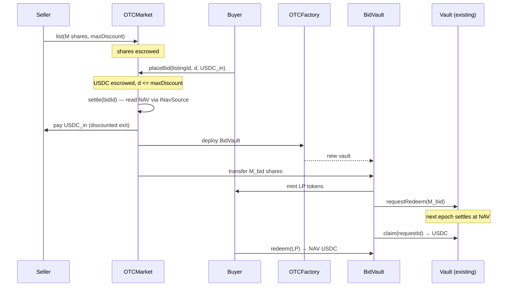

# Implementation Breakdown — OTC Early-Exit (Alt-1, variant 1a)

> **Status:** design-level breakdown for turning variant 1a into Solidity contracts + Foundry scripts.
> **Not** a detailed PRD — no final signatures, no exhaustive edge cases. The goal is to fix the shape: what contracts
> exist, how they wire to the existing `Vault` / `Custody`, the core flows, the decisions to lock, and a test/script plan.
> Concept source: `docs/07-otc-early-exit-alt1-1a.md`. This stays **out of the current POC scope** until explicitly pulled in.

---

## 1. Scope & non-goals

**In scope (this build):**
- A **Layer 0** early-exit market over `rACCESS` shares, on the same Anvil chain, no UI.
- Variant 1a mechanics: **one ERC-4626-style BidVault per buyer bid**, each issuing its own LP token.
- Settlement that pays the seller now and routes the bought shares to the existing redemption queue.
- Foundry contracts, a parameterised demo script, and scenario tests — same discipline as the main POC.

**Non-goals (explicitly deferred):**
- Pooled tiers (variant 2) or FIFO orderbook (variant 3).
- Real off-chain ROuter infra — modelled as a thin, **untrusted trigger** with on-chain validation.
- Fees (0% per POC), Alt-2 / Balancer path, production hardening, gas optimisation.

---

## 2. Where it sits

`vToken == rACCESS shares` (the existing 18-dec vault share). OTC is a new layer **in front of** redemption:

```
Layer 0  OTC early-exit   ◀ NEW (this build)   — seller exits now at a discount
Layer 1  P2P matching     (exists, processEpoch)
Layer 2  liquid buffer    (exists)
Layer 3  illiquid Pruv    (exists)
```

The OTC layer never mints or burns shares itself. It only **moves ownership** of existing shares (seller → buyer/BidVault)
and then uses the *existing* `Vault.requestRedeem` / `claim` to convert escrowed shares to USDC at NAV. So `totalSupply`
and custody backing are untouched → **no NAV double-count** (see §7, decision D3).

---

## 3. Economic model (what actually happens)

Plain-language settlement for one bid:

1. **Seller** locks `M` shares, willing to sell down to a floor price `p_floor = NAV · (1 − maxDiscount)`.
2. **Buyer** bids: discount `d ≤ maxDiscount`, deposits `USDC_in`. Per-share price `p = NAV · (1 − d)`.
3. **Settle:** buyer's `USDC_in` goes **to the seller** (instant discounted exit). `M_bid = USDC_in / p` shares move into
   a new **BidVault**; buyer receives LP tokens = claim on those shares.
4. **BidVault** queues its shares through the normal redemption path (`Vault.requestRedeem`). At the next epoch they
   settle at **full NAV**; BidVault `claim`s the USDC.
5. **Buyer** redeems LP → receives the NAV USDC. Buyer profit = `(NAV − p) · M_bid` (the discount), earned for taking on
   the wait. Seller's cost = the same discount, paid for immediacy.
6. **Unfilled** shares (no buyer) return to the seller, who may queue them normally or relist.

> The protocol takes nothing by default; the discount is a pure seller→buyer transfer. A fee, if ever added, is a cut on
> top (see `docs/06-fees`).

---

## 4. Contracts

New code under `src/otc/`. Four units:

| Contract | Responsibility | Notes |
|---|---|---|
| `OTCMarket` | Single registry/coordinator. Holds listings, escrows seller shares + buyer USDC pre-settlement, validates and triggers settlement. Gated to `Vault` state. | One instance; `Ownable` for config; `nonReentrant` on value-moving calls. |
| `OTCFactory` | Deploys one `BidVault` per accepted bid. | Could be folded into `OTCMarket`; kept separate to mirror the sketch's "vault per buyer". |
| `BidVault` | ERC-4626-style escrow for one bid: holds bought shares, issues LP token, drives `requestRedeem`/`claim`, distributes USDC pro-rata to LP holders. | Minimal; the "gives out vault token" part of 1a. |
| Interfaces | `IOTCMarket`, `IBidVault`. | Signatures locked here before implementation. |

Reused as-is: `Vault` (shares + redeem queue), `Custody`, `MockUSDC`, `INavSource` (read NAV at settle time).

### 4.1 Data model (sketch)

```solidity
struct Listing {
    address seller;
    uint256 shares;          // 18-dec, escrowed in OTCMarket
    uint16  maxDiscountBps;  // seller floor, e.g. 1000 = 10%
    uint256 filled;          // shares already settled
    Status  status;          // Open | Settled | Cancelled
}

struct Bid {
    address buyer;
    uint256 listingId;
    uint16  discountBps;     // must be <= listing.maxDiscountBps
    uint256 usdcIn;          // 6-dec, escrowed in OTCMarket
    address bidVault;        // 0 until settled
    Status  status;
}
```

### 4.2 Function surface (sketch, not final)

`OTCMarket`
- `list(uint256 shares, uint16 maxDiscountBps) → listingId` — seller escrows shares (`SafeERC20` pull).
- `placeBid(uint256 listingId, uint16 discountBps, uint256 usdcIn) → bidId` — buyer escrows USDC; reverts if `discountBps > maxDiscountBps`.
- `settle(uint256 bidId)` — validate against on-chain NAV; deploy BidVault via factory; pay seller; fund BidVault with shares; mint LP to buyer. Permissionless trigger (anyone can call; ROuter is just a convenience caller).
- `cancelBid(bidId)` / `cancelListing(listingId)` — refund escrow before settlement.
- `closeForWindDown()` — admin/`Vault`-driven; refund all open escrow when the vault winds down.

`BidVault` (per bid)
- `constructor(vault, usdc, shares, buyer)` — receives shares, mints LP to buyer, calls `Vault.requestRedeem(shares)`.
- `claimRedemption()` — after the epoch, pulls USDC via `Vault.claim(requestId)`.
- `redeem(uint256 lp)` — buyer burns LP → pro-rata USDC out.

---

## 5. Core flow (sequence)



Unfilled tail: after all bids settle, `OTCMarket` returns `listing.shares - listing.filled` to the seller.

---

## 6. Integration points with existing code

| Touch point | Detail | Risk to check |
|---|---|---|
| `rACCESS` shares (ERC-20) | `approve`/`transferFrom` for seller→market→BidVault | standard |
| `Vault.requestRedeem(shares)` | called by `BidVault` (a contract, not EOA) | confirm Vault accepts contract callers; `requestId` returned & stored |
| `Vault.claim(requestId)` | BidVault pulls settled USDC | reentrancy guard already on `claim` |
| `INavSource.pricePerWRWA()` / `Vault.nav()` | price the bid at settle time | NAV staleness — read at `settle`, not `placeBid` |
| State machine | OTC opens only in `EpochBased`; `closeForWindDown` on `WindDown` | one-way state; refund escrow on close |
| Decimals | shares 18-dec, USDC 6-dec, NAV per `epoch-math.md` (`usdc = shares · nav / 1e18`) | use `Math.mulDiv`, mirror redeem formula exactly |

---

## 7. Decisions to lock before coding

- **D1 — Escrow location.** Shares + USDC sit in `OTCMarket` until settle (chosen), vs straight into BidVault. Market-escrow keeps cancel/refund simple.
- **D2 — Auto-queue vs hold.** Does `BidVault` auto-`requestRedeem` (chosen, matches sketch), or can the buyer choose to *hold* the shares as a vault investor instead of redeeming?
- **D3 — NAV accounting.** Shares in OTC are still outstanding → still backed, no double-count. Confirm nothing re-prices them twice.
- **D4 — Pricing time.** NAV read at `settle` (chosen) — fixes the arb window. Document that a stale NAV between bid and settle is the seller/buyer's risk.
- **D5 — ROuter trust.** `settle` is permissionless and fully validated on-chain (discount ≤ floor, USDC sufficient, NAV read on-chain). ROuter only *triggers*; it cannot misprice or steal. (Alternative: EIP-712 signed bids — deferred.)
- **D6 — Cancel semantics.** Bids/listings cancellable before settle; mirror `cancelRequest` ergonomics. On `WindDown`, force-refund all open escrow.
- **D7 — Fees.** 0% for the POC. Leave a single hook point if a cut is ever added.

---

## 8. Scripts & tests (Foundry)

**Layout** (mirrors the main POC):
- `src/otc/{OTCMarket,OTCFactory,BidVault}.sol`, `src/interfaces/{IOTCMarket,IBidVault}.sol`.
- `test/otc/` — unit per contract + scenario files; each inherits the existing `Fixture` (reuse alice/bob/charlie, funded mocks, deployed Vault+Custody at `EpochBased`).
- `script/DemoOTC.s.sol` — parameterised: `run(string) "OTC-1"` etc., same style as `Demo.s.sol`.

**Scenario tests (acceptance):**

| ID | Scenario | Asserts |
|---|---|---|
| OTC-1 | Single full fill | seller paid discounted USDC; buyer LP = bought shares; after epoch buyer redeems NAV USDC; profit = discount |
| OTC-2 | Partial fill → queue fallback | unsold shares returned to seller; seller can `requestRedeem` the remainder normally |
| OTC-3 | Two bids, different discounts (5% / 10%) | two BidVaults deployed; each buyer settled at their own price; LP tokens non-fungible |
| OTC-4 | Cancel bid / listing before settle | full escrow refund; no BidVault deployed |
| OTC-5 | WindDown mid-listing | `closeForWindDown` refunds all open escrow; settled BidVaults still claimable |
| OTC-6 | Reverts | bid discount > floor; settle below floor price; OTC action outside `EpochBased` |

**Invariants (candidates for `invariant_`):**
- OTC never changes `Vault.totalSupply` except through the existing redeem burn.
- Sum of escrowed USDC + shares is always refundable until settle (no leakage).
- A BidVault's LP totalSupply maps 1:1 to its claimable share/USDC balance.

TDD per `.claude/rules/testing.md`: write the failing scenario first, watch it fail, then implement.

---

## 9. Phasing

- **Phase 0 — P2P discounted swap (cheapest early-exit).** `OTCMarket` only: seller lists, buyer bids, `settle` does an atomic shares↔USDC swap at the discounted price. No BidVault, no LP token. This already delivers early-exit and is the low-cost core.
- **Phase 1 — variant 1a wrapper.** Add `OTCFactory` + `BidVault` + LP token + auto-`requestRedeem`/`claim`. This is the "vault per buyer" part — and the expensive part (one ERC-4626 + LP per bid), exactly the cost flagged in the concept doc.
- **Phase 2 — ROuter / matching polish.** Off-chain matching, partial-fill splitting across multiple bids, optional EIP-712 signed orders.

> Phase 0 alone is a defensible MVP of early-exit. Phases 1–2 buy tradability and price discovery at rising complexity —
> revisit against the pooled/FIFO variants before committing to the per-bid-vault cost.
