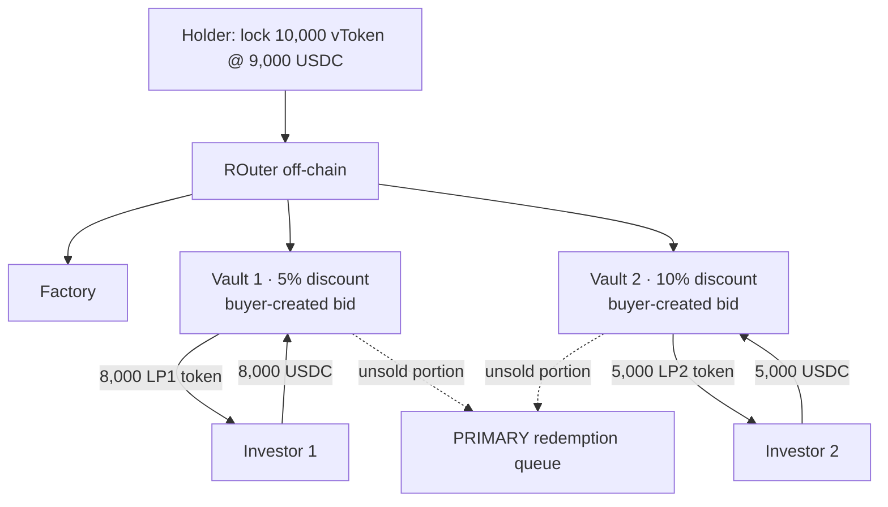

# OTC / Early-Exit Secondary Market — Alt-1, variant 1a

> **Status:** exploratory brainstorm, **not yet in POC scope**. Condensed edition: covers **Alt-1** and **variant 1a** only.
> (Full edition with all 3 variants + Alt-2: `docs/07-otc-early-exit.md`. Vietnamese source: `docs/07-otc-early-exit-alt1-1a.md`.)
> The current retail POC has **no** such layer — the only exit is `requestRedeem` → `processEpoch` → `claim`.

---

## 1. The problem being solved

The problem: **how does a vToken holder exit *now*, before the underlying asset reaches its natural redemption window** —
by reselling to another investor at a **discount**, instead of queuing and waiting.

Two perspectives. The **standalone** view is the primary one — it defines the product, so it gets the detail. The
**retail-integration** view is kept **brief**, just a light pointer back to the current project.

### 1.1 Standalone view (the important one) — "a secondary market for slow-redemption assets"

General context, **independent** of our retail vault:

- There is a token representing a claim on a **slow-to-redeem** asset — call it `vToken` (vault token / fund share).
  Converting `vToken → cash` through the official channel (redeem via the fund) is **slow**: you wait for a
  window / queue, and you are paid at NAV.
- The **seller (holder)** needs cash *now* and accepts **selling below NAV** (a discount) for instant liquidity.
- The **buyer (investor)** is happy to put up USDC now to **buy below NAV**, and then *they* are the ones who wait for
  redemption — earning the discount as yield.

Design problem: build a **secondary market / OTC layer** that meets these requirements:

| Requirement | Why |
|---|---|
| List vToken for sale at some discount | seller signals their exit price |
| Take USDC from buyers *immediately* | instant liquidity for the seller |
| **Price discovery** (which discount clears) | the market prices the liquidity premium |
| **Partial fill** | rarely are there enough buyers for the whole lot |
| **Fallback** for the unsold portion | route to the **PRIMARY redemption queue** (slow channel) — nobody gets stuck |
| Off-chain coordination, on-chain settlement | flexible matching; funds/claims held on-chain |

Core entities:

```
Holder (seller) ── lock vToken @ discount ──► [ listing layer ] ──► Investors (buyers) pay USDC now
                                                     │
                                              unfilled portion
                                                     ▼
                                         PRIMARY redemption queue  (slow channel, NAV)
```

- **ROuter (off-chain):** the coordinator — reads total liquidity (`Check total balance`), splits the vToken lot, matches buyers.
- **Factory:** deploys listings (vaults) on demand.
- **PRIMARY redemption queue:** the original redeem channel where every unsold remainder falls through.

> **The liquidity premium (the discount) is paid by the seller and earned by the buyer** — by default the protocol
> takes nothing (unless a fee is layered on top, see `docs/06-fees`).

### 1.2 Retail-integration view (brief)

Dropped into the current retail vault: `vToken` *is* the **rACCESS shares**, and the OTC layer becomes a **"Layer 0" —
a fast exit placed *in front of* the redemption queue** we already have:

```
Want to exit:
   ┌─ Layer 0  OTC / early-exit   ◀ NEW: sell shares to another retail buyer at a discount, get USDC now
   │     (unsold portion falls through ▼)
   ├─ Layer 1  P2P matching       (exists: net sub vs redeem inside processEpoch)
   ├─ Layer 2  liquid buffer       (exists)
   └─ Layer 3  illiquid Pruv       (exists)
```

Hooks that already exist: NAV is set by the admin each epoch (`INavSource`), so "discount vs NAV" is directly
computable; the redemption queue already exists as the fallback; `vToken` is already a standard ERC-20 share.

The *non*-trivial part of integrating (left open, see §4): Layer 0 sits in front of matching, so it must define a clear
relationship with `cancelRequest`, and whether shares locked in OTC still count toward NAV / can be redeemed in parallel.

#### Why Alt-1 needs this layer

The project is being built as **Alt-1 — self-built custody** (custody we build ourselves: wRWA + liquid buffer;
`totalAssets()` = Pruv price × wRWA + liquid). In Alt-1, custody has **no built-in secondary liquidity** — the only
way out is the **slow redemption queue**. So the early-exit layer is the **missing piece we must build**, and that is
exactly where variant 1a fits: a **Layer 0 OTC** over `rACCESS share`, discount set manually, with the unsold remainder
falling through to the redemption queue.

```
ALT-1 (self-built custody)
──────────────────────────
holder wants to exit
   │
   ├─ FAST: [ OTC Layer 0 ]  ◀ MUST BUILD (variant 1a, manual discount)
   │     unsold ▼
   └─ SLOW: redemption queue (NAV)
```

#### Timeline — fast vs slow within the epoch cadence

Early-exit only matters **between two epoch ticks**: instead of waiting for the next tick to settle at NAV, the holder
exits now and absorbs the discount.

```
 epoch N tick ───────────────── (waiting) ───────────────── epoch N+1 tick
       ▲                                                          ▲
  holder wants to exit here                                  next settlement
       │
       ├─ SLOW (queue) : requestRedeem ───── wait until N+1 ─────► claim @ NAV       exact NAV, costs 1 epoch
       └─ FAST (early) : sell on OTC Layer 0 ──► USDC now @ NAV − discount            fast, absorbs the discount
```

---

## 2. Setup

Every sketch starts from the same situation:

```
Holder buys 10,000 vToken @ 1 USDC        → puts in 10,000 USDC
Holder wants to sell 10,000 vToken, 10% discount  → 1 vToken = 0.9 USDC  → listed at 9,000 USDC
        │
   Lock 10,000 vToken @ 9,000 USDC
        │
   ROuter (off-chain)  ── Check total balance: total 13,000 USDC available from buyers
        │
   ... split the lot + create listings (variant 1a: one vault per buyer) ...
        │
   unsold ──► PRIMARY redemption queue
```

---

## 3. Variant 1a — one vault per buyer (bid-driven, ERC-4626)

*Sketch: "uses ERC 4626 for the vault, gives out vault token". Sibling of **1b** ("normal smart contract to lock, no vault token") — same idea but 1b issues no LP token.*

**Idea:** each **buyer creates their own vault** at the discount *they* choose (a **bid**). Each vault is an
independent ERC-4626 that issues an **LP token** to exactly that buyer.



**Walk-through (reading the frames left→right in the sketch):**

1. Holder locks 10k vToken. Two buyers open two vaults at two different bid levels:
   - **Vault 1 — 5% discount:** Investor 1 deposits 8,000 USDC → receives **8,000 LP1 token**.
   - **Vault 2 — 10% discount:** Investor 2 deposits 5,000 USDC → receives **5,000 LP2 token**.
2. The vToken portion **with no buyer** in each vault → *queued for redemption* (e.g. "5k vToken queued for redemption
   for vault 1 / vault 2").
3. When redemption returns, the vToken in the vault is *"redeemed for ~5.1% USDC"* (note `short exchange.net` in the
   sketch); the investor holds the LP token representing their claim.

**Characteristics:** the discount is **set by the buyer** (each bid = one vault). LP tokens across vaults are **not fungible**.

| Pros | Cons |
|---|---|
| Best price discovery (a true reverse auction) | **Expensive:** each bid = deploy 1 ERC-4626 + 1 LP token |
| LP token can become a further-tradable product | **Fragmented:** N buyers = N vaults, N distinct LP tokens |
| Seller is filled at the best level first | Hard to pool liquidity, heavy to operate |

---

## 4. Open questions (before pulling into scope)

1. Is this OTC layer a **standalone product** or just an **early-exit path** of the retail vault?
2. Do shares locked in OTC still count toward NAV / can they be redeemed in parallel? (avoid double-counting)
3. Do we layer a **fee** on the discount, or leave 100% of the premium to the buyer? (ties into `docs/06-fees` — early-exit / instant-exit)
4. What trust level does off-chain matching (ROuter) need — who runs it, and how is settlement done on-chain so ROuter need not be trusted?
5. Relationship with `cancelRequest` and the state machine: in which state does OTC open (only `EpochBased`?), and does it close on `WindDown`?
6. Is the cost of deploying one ERC-4626 vault + LP token **per bid** acceptable, or do we need to pool (see the other variants in the full edition)?
