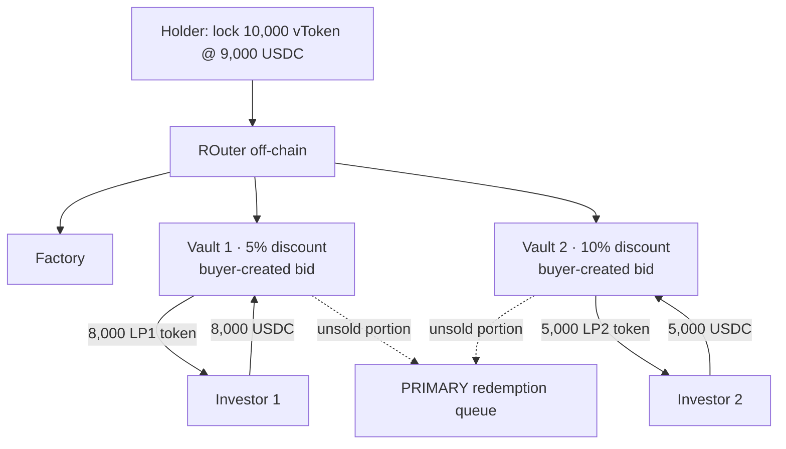
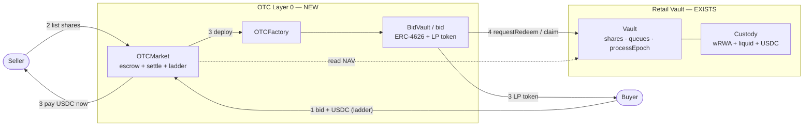

# OTC / Early-Exit Secondary Market — Alt-1, variant 1a

> **Status:** exploratory brainstorm, **not yet in POC scope**. Condensed edition: covers **Alt-1** and **variant 1a** only.
> (Full edition with all 3 variants + Alt-2: `docs/07-otc-early-exit.md`. Vietnamese source: `docs/07-otc-early-exit-alt1-1a.md`.)
> The current retail POC has **no** such layer — the only exit is `requestRedeem` → `processEpoch` → `claim`.

---

## 1. The problem being solved

The problem: **how does a vToken holder exit *now*, before the underlying asset reaches its natural redemption window** —
by reselling to another investor at a **discount**, instead of queuing and waiting.

Two perspectives. The **standalone** view is the primary one — it defines the product, so it gets the detail. The
**retail-integration** view is kept **brief**, just a light pointer back to the current project.

### 1.1 Standalone view (the important one) — "a secondary market for slow-redemption assets"

General context, **independent** of our retail vault:

- There is a token representing a claim on a **slow-to-redeem** asset — call it `vToken` (vault token / fund share).
  Converting `vToken → cash` through the official channel (redeem via the fund) is **slow**: you wait for a
  window / queue, and you are paid at NAV.
- The **seller (holder)** needs cash *now* and accepts **selling below NAV** (a discount) for instant liquidity.
- The **buyer (investor)** is happy to put up USDC now to **buy below NAV**, and then *they* are the ones who wait for
  redemption — earning the discount as yield.

Design problem: build a **secondary market / OTC layer** that meets these requirements:

| Requirement | Why |
|---|---|
| List vToken for sale at some discount | seller signals their exit price |
| Take USDC from buyers *immediately* | instant liquidity for the seller |
| **Price discovery** (which discount clears) | the market prices the liquidity premium |
| **Partial fill** | rarely are there enough buyers for the whole lot |
| **Fallback** for the unsold portion | route to the **PRIMARY redemption queue** (slow channel) — nobody gets stuck |
| Off-chain coordination, on-chain settlement | flexible matching; funds/claims held on-chain |
| **Escrow both sides + atomic settlement** | seller shares and buyer USDC safely locked; the swap is atomic, neither party can default |
| **Cancel/withdraw before a match** | seller pulls a listing, buyer pulls a resting bid → escrow refunded |
| **NAV reference at settle** | the discount is "vs NAV" → needs a trusted price anchor at match time |
| **One share, one place (no double-spend)** | a share in OTC is not simultaneously in the redeem queue |

Core entities:

```
Holder (seller) ── lock vToken @ discount ──► [ listing layer ] ──► Investors (buyers) pay USDC now
                                                     │
                                              unfilled portion
                                                     ▼
                                         PRIMARY redemption queue  (slow channel, NAV)
```

- **ROuter (off-chain):** the coordinator — reads total liquidity (`Check total balance`), splits the vToken lot, matches buyers.
- **Factory:** deploys listings (vaults) on demand.
- **PRIMARY redemption queue:** the original redeem channel where every unsold remainder falls through.

> **The liquidity premium (the discount) is paid by the seller and earned by the buyer** — by default the protocol
> takes nothing (unless a fee is layered on top, see `docs/06-fees`).

### 1.2 Retail-integration view (brief)

Dropped into the current retail vault: `vToken` *is* the **rACCESS shares**, and the OTC layer becomes a **"Layer 0" —
a fast exit placed *in front of* the redemption queue** we already have:

```
Want to exit:
   ┌─ Layer 0  OTC / early-exit   ◀ NEW: sell shares to another retail buyer at a discount, get USDC now
   │     (unsold portion falls through ▼)
   ├─ Layer 1  P2P matching       (exists: net sub vs redeem inside processEpoch)
   ├─ Layer 2  liquid buffer       (exists)
   └─ Layer 3  illiquid Pruv       (exists)
```

Hooks that already exist: NAV is set by the admin each epoch (`INavSource`), so "discount vs NAV" is directly
computable; the redemption queue already exists as the fallback; `vToken` is already a standard ERC-20 share.

The *non*-trivial part of integrating (left open, see §4): Layer 0 sits in front of matching, so it must define a clear
relationship with `cancelRequest`, and whether shares locked in OTC still count toward NAV / can be redeemed in parallel.

#### Why Alt-1 needs this layer

The project is being built as **Alt-1 — self-built custody** (custody we build ourselves: wRWA + liquid buffer;
`totalAssets()` = Pruv price × wRWA + liquid). In Alt-1, custody has **no built-in secondary liquidity** — the only
way out is the **slow redemption queue**. So the early-exit layer is the **missing piece we must build**, and that is
exactly where variant 1a fits: a **Layer 0 OTC** over `rACCESS share`, discount set manually, with the unsold remainder
falling through to the redemption queue.

```
ALT-1 (self-built custody)
──────────────────────────
holder wants to exit
   │
   ├─ FAST: [ OTC Layer 0 ]  ◀ MUST BUILD (variant 1a, manual discount)
   │     unsold ▼
   └─ SLOW: redemption queue (NAV)
```

#### Timeline — fast vs slow within the epoch cadence

Early-exit only matters **between two epoch ticks**: instead of waiting for the next tick to settle at NAV, the holder
exits now and absorbs the discount.

```
 epoch N tick ───────────────── (waiting) ───────────────── epoch N+1 tick
       ▲                                                          ▲
  holder wants to exit here                                  next settlement
       │
       ├─ SLOW (queue) : requestRedeem ───── wait until N+1 ─────► claim @ NAV       exact NAV, costs 1 epoch
       └─ FAST (early) : sell on OTC Layer 0 ──► USDC now @ NAV − discount            fast, absorbs the discount
```

---

## 2. Setup

Every sketch starts from the same situation:

```
Holder buys 10,000 vToken @ 1 USDC        → puts in 10,000 USDC
Holder wants to sell 10,000 vToken, 10% discount  → 1 vToken = 0.9 USDC  → listed at 9,000 USDC
        │
   Lock 10,000 vToken @ 9,000 USDC
        │
   ROuter (off-chain)  ── Check total balance: total 13,000 USDC available from buyers
        │
   ... split the lot + create listings (variant 1a: one vault per buyer) ...
        │
   unsold ──► PRIMARY redemption queue
```

---

## 3. Variant 1a — one vault per buyer (bid-driven, ERC-4626)

*Sketch: "uses ERC 4626 for the vault, gives out vault token". Sibling of **1b** ("normal smart contract to lock, no vault token") — same idea but 1b issues no LP token.*

**Idea:** each **buyer creates their own vault** at the discount *they* choose (a **bid**). Each vault is an
independent ERC-4626 that issues an **LP token** to exactly that buyer.



**Walk-through (reading the frames left→right in the sketch):**

1. Holder locks 10k vToken. Two buyers open two vaults at two different bid levels:
   - **Vault 1 — 5% discount:** Investor 1 deposits 8,000 USDC → receives **8,000 LP1 token**.
   - **Vault 2 — 10% discount:** Investor 2 deposits 5,000 USDC → receives **5,000 LP2 token**.
2. The vToken portion **with no buyer** in each vault → *queued for redemption* (e.g. "5k vToken queued for redemption
   for vault 1 / vault 2").
3. When redemption returns, the vToken in the vault is *"redeemed for ~5.1% USDC"* (note `short exchange.net` in the
   sketch); the investor holds the LP token representing their claim.

**Characteristics:** the discount is **set by the buyer** (each bid = one vault). LP tokens across vaults are **not fungible**.

| Pros | Cons |
|---|---|
| Best price discovery (a true reverse auction) | **Expensive:** each bid = deploy 1 ERC-4626 + 1 LP token |
| LP token can become a further-tradable product | **Fragmented:** N buyers = N vaults, N distinct LP tokens |
| Seller is filled at the best level first | Hard to pool liquidity, heavy to operate |

---

## 4. Resolved decisions

| # | Question | Decision |
|---|---|---|
| 1 | Standalone or early-exit path? | **Early-exit path** of the retail vault (Layer 0). |
| 2 | Can OTC-locked shares be redeemed / do they double-count NAV? | **Escrow via `transferFrom` at list time** → holder loses the redeem right. A share lives in exactly **one** place at a time (wallet / queue / OTC). It stays in `totalSupply` → **no double-count**. After settle, the **BidVault** owns the share, so *it* calls `requestRedeem`. |
| 3 | Fee on the discount? | **Skip** (0% for the POC), leave one hook. |
| 4 | On-chain matching or a keeper? | **On-chain by default** (see §9). Buyers post bids (USDC escrowed) that rest; **the seller's `sell()` tx sweeps bids cheapest-first and settles atomically on-chain** — no keeper, consistent with `processEpoch` matching. Cap bids scanned per tx for gas. A keeper/ROuter is only an **optional Phase 2** (off-chain allocation, then settle the result). |
| 5 | Relationship with `cancelRequest` + which state? | Only list shares **free in the wallet** → OTC and the redeem queue are **mutually exclusive**, so `cancelRequest` is untouched. OTC **opens only in `EpochBased`**; `triggerWindDown` **refunds all open escrow**, while settled BidVaults flow on through wind-down at NAV. |
| 6 | Gas of deploying vault+LP per bid? | **Accepted**, ignored. |

---

## 5. Matching dynamics & incentives

**Both sides' incentive** — the discount is the *price of immediacy*:

| | Seller (exiting) | Buyer |
|---|---|---|
| Wants | cash **now** | **Delta** (buy below NAV) |
| On the discount | **pays** | **earns** |
| Alternative | `requestRedeem` → wait ~1 epoch, get full NAV | hold USDC, do nothing |

A trade clears when there is overlap: `value-of-immediacy(seller) > discount > cost-of-waiting(buyer)`. No overlap → no match → falls to the queue.

**Who appears first? → Buyers first.** For a genuinely *fast* exit, buy-side liquidity must be **resting**; the seller arrives and **fills instantly**:

```
Resting bids on a ladder (USDC already escrowed). Each [b] = one buyer's bid-vault:
   1%   [b][b]          ◄ cheapest for the seller  → fill FIRST
   2.5% [b]
   5%   [b][b][b]
   10%  [b]             ◄ most expensive           → fill LAST

Seller sells M shares (keeps a floor = max acceptable discount):
   sweep cheapest-first: 1% → 2.5% → 5% ...   (only take levels ≤ floor)
       ├─ enough buyers → USDC NOW @ NAV − discount        (fast exit)
       └─ short / empty → remainder → REDEMPTION QUEUE @ NAV (slow, NO discount)
```
- **Buyer = price-maker** (sets the discount), **Seller = price-taker** (takes the cheapest bid first; only keeps a **floor**).
- Seller-first would turn OTC into "another queue" → loses all the speed value.

**No liquidity (cold-start):**
- The unsold portion → **redemption queue, paid full NAV, NO discount**. → there is **no "discount death-spiral"**: the leftover loses only *speed* (waits one epoch), **not price**.
- So **"a buyer is required for early-exit" is acceptable** — the fallback leaves nobody stuck and nobody worse off. (A protocol backstop pool quoting a fixed discount is a bigger feature → deferred.)

---

## 6. How the discount is set — keep 1a but NOT free

If buyers set the discount **freely / continuously** → liquidity **fragments** (3.1% / 3.15% / 4.2%…), pools are thin, the seller struggles to fill fast. But pooling-per-tier is **variant 2**, not the assignment.

Resolve it by separating **two independent axes**:
- **Axis A — discount value:** free ⟷ **fixed ladder**.
- **Axis B — vault grouping:** one-vault-per-buyer (**1a**) ⟷ shared pool per tier (**2**).

```
                          Axis B — vault grouping
              one-vault-per-buyer (1a)    │    shared pool per tier (2)
            ┌─────────────────────────────┼─────────────────────────────┐
   free     │  1a free                    │  (rarely used)               │
  Axis A    │  fragmented price           │                             │
  (price)   ├─────────────────────────────┼─────────────────────────────┤
  ladder    │  ★ 1a + ladder  ← CHOSEN     │  variant 2                   │
            │  own LP, concentrated price  │  fungible LP, concentrated   │
            └─────────────────────────────┴─────────────────────────────┘
   Tighten axis A (free → ladder) but KEEP axis B = 1a  →  still 1a, not variant 2.
```

What *defines* variant 2 is **axis B = pooling** (shared vault + fungible LP), **not** "discrete prices". So we tighten **axis A** while keeping **axis B = 1a**:

> **Decision: 1a + a small fixed discount ladder** (e.g. {1% / 2.5% / 5% / 10%}, set by governance at config). Each buyer **still gets their own vault + own LP**; the only change is the discount **must be chosen from the ladder**.

Comparison (two buyers both pick 5%):

| | Vault | LP token | Discount | What it is |
|---|---|---|---|---|
| 1a free | one vault per buyer | own, non-fungible | **any %** | fragmented price |
| **1a + ladder (chosen)** | **one vault per buyer** | **own, non-fungible** | **from ladder** | **still 1a, disciplined price** |
| variant 2 | **one vault per tier (shared)** | **fungible in tier** | from ladder | pooling |

- ✅ The ladder **concentrates liquidity at a few price points** (Schelling points) → the seller sweeping cheapest-first hits real depth → fixes the free downside.
- ✅ **Still genuinely 1a:** vault-per-buyer + own LP + buyer-created bid.
- ⚠️ What 1a does **not** remove (and we accept): LP is **not fungible** across buyers + **many vaults**. Removing those → must pool → becomes variant 2.

---

## 7. Locked design (summary)

**Early-exit Layer 0 along variant 1a, with price discipline:**

1. Goal: early-exit path of the retail vault; unsold remainder → redemption queue at NAV.
2. **Buyer-first:** buyers post bids, **USDC escrowed immediately**, resting. Each bid = 1 ERC-4626 vault + 1 own LP token.
3. **Discount from a fixed ladder** (config), not free — concentrates liquidity yet stays 1a.
4. **Seller** lists shares **free in the wallet** (escrowed at list) → fills **cheapest-first**; keeps only a **floor**.
5. **NAV read on-chain at settle**; no double-count (shares stay in `totalSupply`).
6. **On-chain matching:** the seller's `sell()` tx sweeps bids cheapest-first and settles atomically (cap bids/tx). No keeper; off-chain matching is an optional Phase 2.
7. **State:** open in `EpochBased`; `WindDown` refunds open escrow, settled BidVaults flow on at NAV.
8. Fee 0%, gas ignored (POC).

---

## 8. Implementation direction 

**Reuse the whole existing vault; add 3 contracts for the OTC Layer 0.**



**End-to-end flow:**
1. **Buyer** posts a bid (discount from the ladder), **USDC escrowed**, resting.
2. **Seller** lists shares free in the wallet → escrowed.
3. **Seller calls `sell()`** — the tx sweeps bids cheapest-first and settles on-chain: seller **paid USDC now**; **BidVault** deployed holding the shares, mints **LP** to the buyer. (No keeper.)
4. BidVault `requestRedeem` → the next `processEpoch` settles at NAV → `claim` USDC.
5. **Buyer** redeems LP → USDC @ NAV; profit = the discount. Unsold → redemption queue @ NAV.

**Roadmap (de-risk in steps):**
- **Phase 0** — `OTCMarket` only: atomic share↔USDC swap at a discount (no BidVault/LP). *Early-exit already works, cheapest.*
- **Phase 1** — add `OTCFactory` + `BidVault` + LP + auto-redeem → full variant 1a.
- **Phase 2** — *optional:* off-chain matching/keeper to optimize allocation + cut seller gas, EIP-712 (if needed). The core path does not depend on it.

> Pitch to a manager: **the core contracts are untouched** (Vault/Custody unchanged); OTC is just a layer *in front of* the redemption queue; risk is contained in the 3 new contracts and can ship phase by phase.

---

## 9. On-chain matching (no keeper)

Because we locked **a fixed ladder + buyer-first + cheapest-first**, matching is simple enough to run **inside the seller's tx** — no off-chain matcher. Consistent with `processEpoch`'s on-chain matching.

```
seller.sell(shares, floor):
   nav = read NAV on-chain (INavSource)
   for tier in ladder (cheap → expensive, stop when tier > floor):
       for bid in bidQueue[tier]   (FIFO, cap N bids/tx for gas):
           fill: pay USDC to seller · escrow shares into a BidVault · mint LP to buyer
           if shares exhausted: break
   remainder → seller routes to the redemption queue (NAV)
```

- **Bid book = a FIFO array per ladder rung** (a few rungs) → no sorting, near-O(1) insert/cancel, bounded scan.
- **Atomic**: the whole sweep is one tx; clean revert on error. Nobody defaults.
- **Gas** is paid by the seller (they want the liquidity), bounded by the cap N — like the Vault's 100/epoch cap.

**When off-chain matching is worth it (Phase 2):** many competing sellers wanting globally-optimal allocation, or cutting seller gas by computing off-chain and only `settle`-ing the result (still on-chain validated). Not required for the core path.
