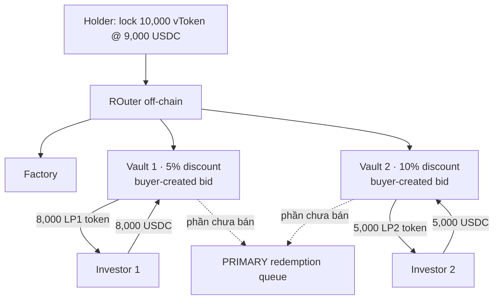
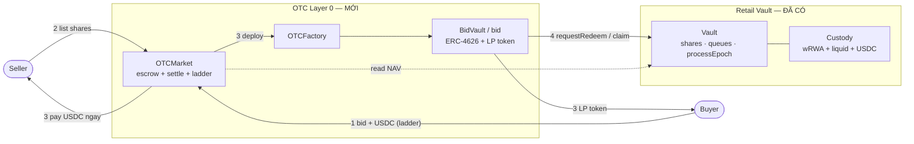

# OTC / Early-Exit Secondary Market — Alt-1, variant 1a

> **Trạng thái:** brainstorm khám phá, **chưa vào scope POC**. Bản rút gọn: chỉ trình bày **Alt-1** và **variant 1a**.
> (Bản đầy đủ 3 variant + Alt-2: `docs/07-otc-early-exit.md`.)
> POC retail hiện tại **không có** lớp này — đường thoát duy nhất là `requestRedeem` → `processEpoch` → `claim`.

---

## 1. Bài toán đang giải

Bài toán: **làm sao để người giữ vToken thoát vốn *ngay*, trước khi tài sản nền đến kỳ redemption tự nhiên** — bằng
cách bán lại cho nhà đầu tư khác ở **mức chiết khấu**, thay vì xếp hàng chờ.

Có hai góc nhìn. Góc **standalone** là góc chính — nó định nghĩa sản phẩm, nên trình bày kỹ. Góc **ghép vào retail**
chỉ nêu **ngắn gọn**, liên hệ nhẹ sang project hiện tại.

### 1.1 Góc standalone (quan trọng hơn) — "chợ thứ cấp cho tài sản redemption-chậm"

Bối cảnh tổng quát, **không phụ thuộc** vault retail của ta:

- Có một loại token đại diện quyền với tài sản **redemption chậm** — gọi chung là `vToken` (vault token / fund share).
Muốn đổi `vToken → tiền mặt` theo kênh chính thức (redeem qua quỹ) thì **chậm**: phải chờ cửa sổ / hàng đợi, và
trả theo NAV.
- **Người bán (holder)** cần tiền *bây giờ*, chấp nhận **bán dưới NAV** (chiết khấu) để có thanh khoản tức thì.
- **Người mua (investor)** sẵn sàng bỏ USDC ngay để **mua rẻ hơn NAV**, rồi *họ* mới là người chịu chờ redemption →
ăn phần chiết khấu như lợi suất.

Bài toán thiết kế: dựng một **secondary market / OTC layer** đáp ứng các yêu cầu:


| Yêu cầu                                    | Vì sao                                                            |
| ------------------------------------------ | ----------------------------------------------------------------- |
| Niêm yết bán vToken ở một mức chiết khấu   | người bán phát tín hiệu giá thoát                                 |
| Nhận USDC từ người mua *ngay*              | thanh khoản tức thì cho người bán                                 |
| **Khám phá giá** (mức chiết khấu nào khớp) | thị trường tự định giá phần bù thanh khoản                        |
| **Khớp một phần (partial fill)**           | hiếm khi có đủ người mua cho toàn bộ lô                           |
| **Fallback** phần không bán được           | đẩy về **PRIMARY redemption queue** (kênh chậm) — không ai bị kẹt |
| Điều phối off-chain, settle on-chain       | matching linh hoạt; tiền/đối tượng giữ on-chain                   |
| **Escrow cả hai phía + settle atomic** | share của seller và USDC của buyer khóa an toàn; swap nguyên tử, không ai default được |
| **Hủy/rút trước khi khớp** | seller gỡ listing, buyer rút bid đang chờ → đòi lại escrow |
| **Tham chiếu NAV lúc settle** | discount là "so với NAV" → cần mốc giá đáng tin tại thời điểm khớp |
| **Một share một chỗ (chống double-spend)** | share đã vào OTC thì không đồng thời nằm trong redeem queue |


Các thực thể chính:

```
Holder (seller) ── lock vToken @ discount ──► [ listing layer ] ──► Investors (buyers) pay USDC now
                                                     │
                                            phần không khớp
                                                     ▼
                                         PRIMARY redemption queue  (kênh chậm, NAV)
```

- **ROuter (off-chain):** bộ điều phối — đọc tổng thanh khoản (`Check total balance`), chia lô vToken, ghép người mua.
- **Factory:** deploy các listing (vault) khi cần.
- **PRIMARY redemption queue:** kênh redeem gốc, nơi mọi phần ế rơi về.

> **Phần bù thanh khoản (chiết khấu) là tiền người bán *trả*, người mua *ăn*** — mặc định giao thức không lấy gì
> (trừ khi cắm thêm một khoản phí lên trên, xem `docs/06-fees`).

### 1.2 Góc ghép vào project retail (liên hệ ngắn)

Đặt vào vault retail hiện tại: `vToken` chính là **rACCESS shares**, và lớp OTC trở thành một **"Layer 0" — đường thoát
nhanh đặt *trước* hàng đợi redemption** ta đã có:

```
Muốn rút:
   ┌─ Layer 0  OTC / early-exit   ◀ MỚI: bán share cho retail khác ở discount, nhận USDC ngay
   │     (phần không bán được rơi xuống ▼)
   ├─ Layer 1  P2P matching       (đã có: net sub vs redeem trong processEpoch)
   ├─ Layer 2  liquid buffer       (đã có)
   └─ Layer 3  illiquid Pruv       (đã có)
```

Điểm móc nối sẵn có: NAV đã được admin set mỗi epoch (`INavSource`) nên "discount so với NAV" tính được ngay; redemption
queue đã tồn tại làm fallback; `vToken` đã là ERC-20 share chuẩn.

Phần *không* trivial khi ghép (để mở, xem §4): Layer 0 đứng trước matching nên phải định nghĩa rõ quan hệ với
`cancelRequest`, và share đang khóa trong OTC có còn được tính NAV / redeem song song hay không.

#### Vì sao Alt-1 cần lớp này

Project đang build theo **Alt-1 — self-built custody** (custody tự build: wRWA + liquid buffer; `totalAssets()` =
giá Pruv × wRWA + liquid). Trong Alt-1, custody **không có thanh khoản thứ cấp sẵn** — đường ra duy nhất là
**redemption queue chậm**. Vì vậy lớp early-exit là **mảnh còn thiếu, phải tự dựng**, và đây chính là chỗ variant 1a
lấp vào: một **Layer 0 OTC** trên `rACCESS share`, discount đặt thủ công, phần ế rơi xuống redemption queue.

```
ALT-1 (self-built custody)
──────────────────────────
holder muốn thoát
   │
   ├─ NHANH: [ OTC Layer 0 ]  ◀ PHẢI BUILD (variant 1a, discount thủ công)
   │     phần ế ▼
   └─ CHẬM: redemption queue (NAV)
```

#### Timeline — nhanh vs chậm trong nhịp epoch

Early-exit chỉ có nghĩa **giữa hai epoch tick**: thay vì chờ tick kế để settle theo NAV, holder thoát ngay và chịu chiết khấu.

```
 epoch N tick ───────────────── (khoảng chờ) ───────────────── epoch N+1 tick
       ▲                                                              ▲
  holder muốn thoát ở đây                                       settlement kế tiếp
       │
       ├─ CHẬM  (queue)  : requestRedeem ───── chờ tới N+1 ─────► claim @ NAV          đúng NAV, mất 1 epoch
       └─ NHANH (early)  : bán trên OTC Layer 0 ──► USDC ngay @ NAV − discount         nhanh, chịu chiết khấu
```

---

## 2. Setup

Mọi sketch bắt đầu từ cùng một tình huống:

```
Holder mua 10,000 vToken @ 1 USDC        → bỏ vào 10,000 USDC
Holder muốn bán 10,000 vToken, discount 10%  → 1 vToken = 0.9 USDC  → niêm yết 9,000 USDC
        │
   Lock   vToken @ 9,000 USDC
        │
   ROuter (off-chain)  ── Check total balance: total 13,000 USDC khả dụng từ người mua
        │
   ... chia lô + tạo listing (variant 1a: một vault mỗi người mua) ...
        │
   phần ế ──► PRIMARY redemption queue
```

---

## 3. Variant 1a — vault mỗi người mua (bid-driven, ERC-4626)

*Sketch: "uses ERC 4626 for the vault, gives out vault token". Anh em với **1b** ("normal smart contract to lock, no vault token") — cùng ý tưởng nhưng 1b không phát LP token.*

**Ý tưởng:** mỗi **người mua tự tạo một vault riêng** ở mức discount *họ* chọn (một cú **bid**). Mỗi vault là một
ERC-4626 độc lập, phát **LP token riêng** cho đúng người mua đó.




**Diễn biến (đọc theo các khung trái→phải trong sketch):**

1. Holder lock 10k vToken. Hai người mua mở hai vault ở hai mức bid khác nhau:
  - **Vault 1 — 5% discount:** Investor 1 nạp 8,000 USDC → nhận **8,000 LP1 token**.
  - **Vault 2 — 10% discount:** Investor 2 nạp 5,000 USDC → nhận **5,000 LP2 token**.
2. Phần vToken **chưa có người mua** trong mỗi vault → *queued for redemption* (vd "5k vToken queued for redemption
  for vault 1 / vault 2").
3. Khi redemption về, vToken trong vault được *"redeemed for ~5.1% USDC"* (ghi chú `short exchange.net` trong sketch),
  investor giữ LP token tương ứng với quyền của mình.

**Đặc trưng:** discount **do người mua quyết** (mỗi bid = một vault). LP token mỗi vault **không thay thế nhau**.


| Ưu                                                | Nhược                                                   |
| ------------------------------------------------- | ------------------------------------------------------- |
| Khám phá giá tốt nhất (reverse auction thật)      | **Đắt:** mỗi bid = deploy 1 ERC-4626 + 1 LP token       |
| LP token có thể trở thành sản phẩm giao dịch tiếp | **Phân mảnh:** N người mua = N vault, N loại LP rời rạc |
| Người bán được lấp ở mức tốt nhất trước           | Khó gộp thanh khoản, vận hành nặng                      |


---

## 4. Các câu hỏi đã chốt

| # | Câu hỏi | Quyết định |
|---|---|---|
| 1 | Standalone hay early-exit path? | **Early-exit path** của vault retail (Layer 0). |
| 2 | Share khóa trong OTC có redeem được / có double-count NAV? | **Escrow bằng `transferFrom` ngay lúc list** → holder mất quyền redeem. Một share một thời điểm chỉ ở **một chỗ** (ví / queue / OTC). Vẫn nằm trong `totalSupply` → **không double-count**. Sau settle, **BidVault** sở hữu share nên *nó* mới `requestRedeem`. |
| 3 | Có thu phí trên discount? | **Bỏ qua** (0% cho POC), để 1 hook. |
| 4 | Matching on-chain hay cần keeper? | **On-chain mặc định** (xem §9). Buyer đặt bid (USDC escrow sẵn) đứng chờ; **tx `sell()` của seller tự quét bid cheapest-first và settle nguyên tử on-chain** — không cần keeper, đồng nhất với matching của `processEpoch`. Cap số bid duyệt/tx để chặn gas. Keeper/ROuter chỉ là **tùy chọn Phase 2** (tối ưu phân bổ off-chain rồi settle kết quả). |
| 5 | Quan hệ `cancelRequest` + state nào? | Chỉ list share **đang free trong ví** → OTC và redeem queue **loại trừ nhau**, `cancelRequest` không phải sửa. OTC **chỉ mở trong `EpochBased`**; `triggerWindDown` **refund mọi escrow đang mở**, BidVault đã settle chảy tiếp qua wind-down ở NAV. |
| 6 | Gas deploy vault+LP mỗi bid? | **Chấp nhận**, bỏ qua. |

---

## 5. Cơ chế khớp & động lực

**Động lực hai bên** — discount là *giá của sự tức thì*:

| | Seller (thoát) | Buyer (mua) |
|---|---|---|
| Muốn | tiền **ngay** | **lợi suất** (mua dưới NAV) |
| Với discount | **trả** | **ăn** |
| Thay thế | `requestRedeem` → chờ ~1 epoch, nhận đủ NAV | giữ USDC, không làm gì |

Khớp khi có vùng chồng: `value-of-immediacy(seller) > discount > cost-of-waiting(buyer)`. Không chồng → không khớp → rơi xuống queue.

**Ai xuất hiện trước? → Buyer trước.** Để là early-exit *nhanh thật*, thanh khoản mua phải **đứng sẵn**; seller đến **fill ngay**:

```
Các bid đứng sẵn theo ladder (USDC đã escrow). Mỗi [b] = 1 bid-vault của 1 buyer:
   1%   [b][b]          ◄ rẻ nhất cho seller  → fill TRƯỚC
   2.5% [b]
   5%   [b][b][b]
   10%  [b]             ◄ đắt nhất            → fill SAU

Seller bán M share (giữ floor = discount tối đa chấp nhận):
   quét cheapest-first: 1% → 2.5% → 5% ...   (chỉ lấy mức ≤ floor)
       ├─ đủ buyer     → nhận USDC NGAY @ NAV − discount        (thoát nhanh)
       └─ thiếu / rỗng → phần dư → REDEMPTION QUEUE @ NAV        (chậm, KHÔNG discount)
```
- **Buyer = price-maker** (đặt discount), **Seller = price-taker** (lấy bid rẻ nhất trước; chỉ giữ một **floor** = discount tối đa chấp nhận).
- Seller-trước sẽ biến OTC thành "một hàng đợi khác" → mất hết giá trị tốc độ.

**Không có thanh khoản thì sao (cold-start):**
- Phần ế → **redemption queue, nhận đủ NAV, KHÔNG discount**. → **không có vòng xoáy "discount xấu dần"**: ế chỉ mất *tốc độ* (chờ 1 epoch), **không mất giá**.
- Vì vậy **"phải có buyer mới early-exit" là chấp nhận được** — fallback không ai kẹt, không ai lỗ. (Backstop pool báo giá cố định là feature lớn hơn → defer.)

---

## 6. Discount quyết thế nào — giữ 1a nhưng KHÔNG để tự do

Nếu để buyer đặt discount **tự do liên tục** → thanh khoản **phân mảnh** (3.1% / 3.15% / 4.2%…), pool nông, seller khó lấp nhanh. Nhưng pool-chung-theo-tier lại là **variant 2**, không phải đề bài.

Gỡ bằng cách tách **2 trục độc lập**:
- **Trục A — giá trị discount:** tự do ⟷ **ladder cố định**.
- **Trục B — gom vault:** mỗi-người-một-vault (**1a**) ⟷ pool chung theo tier (**2**).

```
                          Trục B — gom vault
             mỗi-người-một-vault (1a)    │    pool chung theo tier (2)
           ┌─────────────────────────────┼─────────────────────────────┐
   tự do   │  1a free                    │  (hầu như không dùng)        │
  Trục A   │  giá phân mảnh              │                             │
  (giá)    ├─────────────────────────────┼─────────────────────────────┤
  ladder   │  ★ 1a + ladder  ← CHỌN       │  variant 2                   │
           │  LP riêng, giá gom           │  LP fungible, giá gom        │
           └─────────────────────────────┴─────────────────────────────┘
   Siết trục A (tự do → ladder) nhưng GIỮ trục B = 1a  →  vẫn là 1a, không thành 2.
```

Điều *định nghĩa* variant 2 là **trục B = pooling** (vault chung + LP fungible), **không phải** "giá rời rạc". Nên ta siết **trục A** mà **giữ nguyên trục B = 1a**:

> **Phương án: 1a + một ladder discount cố định nhỏ** (vd {1% / 2.5% / 5% / 10%}, governance đặt khi config). Mỗi buyer **vẫn vault riêng + LP riêng**; chỉ khác: discount **phải chọn trong ladder**.

So sánh 3 lựa chọn (hai buyer cùng chọn 5%):

| | Vault | LP token | Discount | Là gì |
|---|---|---|---|---|
| 1a free | mỗi người 1 vault | riêng, non-fungible | **bất kỳ %** | phân mảnh giá |
| **1a + ladder (chọn)** | **mỗi người 1 vault** | **riêng, non-fungible** | **trong ladder** | **vẫn 1a, có kỷ luật giá** |
| variant 2 | **1 vault/tier (chung)** | **fungible trong tier** | trong ladder | pooling |

- ✅ Ladder **gom thanh khoản về vài điểm giá** (Schelling points) → seller sweep cheapest-first gặp depth thật → fix nhược điểm free.
- ✅ **Vẫn đúng 1a:** vault-per-buyer + LP riêng + buyer-created bid.
- ⚠️ Cái 1a **không** xóa được (đã chấp nhận): LP **không fungible** giữa buyer + **nhiều vault**. Muốn xóa → phải pool → thành variant 2.

---

## 7. Phương án chốt (tóm tắt)

**Early-exit Layer 0 theo variant 1a, có kỷ luật giá:**

1. Mục tiêu: early-exit path của vault retail; phần ế → redemption queue ở NAV.
2. **Buyer-first:** buyer đặt bid, **USDC escrow ngay**, đứng chờ. Mỗi bid = 1 vault ERC-4626 + 1 LP token riêng.
3. **Discount theo ladder cố định** (config), không tự do — gom thanh khoản nhưng vẫn 1a.
4. **Seller** list share **free trong ví** (escrow lúc list) → fill **cheapest-first**; chỉ giữ **floor**.
5. **NAV đọc on-chain lúc settle**; không double-count (share vẫn trong `totalSupply`).
6. **Matching on-chain:** tx `sell()` của seller tự quét bid cheapest-first + settle nguyên tử (cap số bid/tx). Không cần keeper; off-chain matching là tùy chọn Phase 2.
7. **State:** mở trong `EpochBased`; `WindDown` refund escrow mở, BidVault đã settle chảy tiếp ở NAV.
8. Fee 0%, gas bỏ qua (POC).

---

## 8. Hướng triển khai (present nhanh)

**Tái dùng toàn bộ vault hiện có; thêm 3 contract cho Layer 0 OTC.**



**Flow đầu-cuối:**
1. **Buyer** đặt bid (discount theo ladder), **USDC escrow**, đứng chờ.
2. **Seller** list share free trong ví → escrow.
3. **Seller gọi `sell()`** — tx tự quét bid cheapest-first + settle on-chain: seller **nhận USDC ngay**; deploy **BidVault** giữ share, mint **LP** cho buyer. (Không cần keeper.)
4. BidVault `requestRedeem` → `processEpoch` kế settle ở NAV → `claim` USDC.
5. **Buyer** redeem LP → USDC @ NAV; lời = discount. Phần ế → redemption queue @ NAV.

**Lộ trình (giảm rủi ro theo từng bước):**
- **Phase 0** — chỉ `OTCMarket`: swap share↔USDC nguyên tử ở discount (chưa BidVault/LP). *Đã có early-exit, rẻ nhất.*
- **Phase 1** — thêm `OTCFactory` + `BidVault` + LP + auto-redeem → đủ variant 1a.
- **Phase 2** — *tùy chọn:* off-chain matching/keeper để tối ưu phân bổ + giảm gas cho seller, EIP-712 (nếu cần). Path lõi không phụ thuộc cái này.

> Điểm bán với manager: **không đụng contract lõi** (Vault/Custody giữ nguyên), OTC chỉ là lớp đặt *trước* redemption queue; rủi ro khu trú trong 3 contract mới, làm được theo từng phase.

---

## 9. Matching on-chain (không cần keeper)

Vì đã chốt **ladder cố định + buyer-first + cheapest-first**, matching đủ đơn giản để chạy **ngay trong tx của seller**, không cần off-chain matcher. Đồng nhất triết lý với matching on-chain của `processEpoch`.

```
seller.sell(shares, floor):
   nav = đọc NAV on-chain (INavSource)
   for tier in ladder (rẻ → đắt, dừng khi tier > floor):
       for bid in bidQueue[tier]   (FIFO, cap N bid/tx để chặn gas):
           fill: trả USDC cho seller · escrow share vào BidVault · mint LP cho buyer
           if đã đủ shares: break
   phần dư → seller tự đẩy xuống redemption queue (NAV)
```

- **Bid book = mảng FIFO theo từng nấc ladder** (vài nấc) → không cần sort, insert/cancel O(1)-ish, duyệt bounded.
- **Atomic**: cả vòng quét nằm trong một tx; revert sạch nếu lỗi. Không ai default.
- **Gas** do seller trả (họ muốn thanh khoản), chặn bằng cap N — giống cap 100/epoch của Vault.

**Khi nào cần off-chain matching (Phase 2):** nhiều seller cạnh tranh + muốn tối ưu phân bổ toàn cục, hoặc muốn giảm gas cho seller bằng cách tính off-chain rồi chỉ `settle` kết quả (vẫn validate on-chain). Không bắt buộc cho path lõi.

