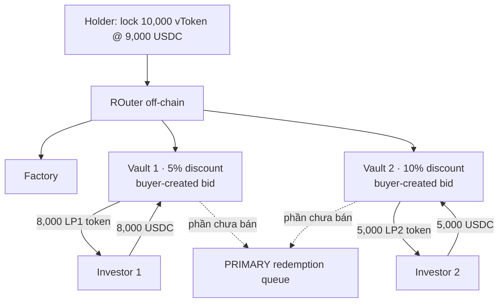

# OTC / Early-Exit Secondary Market — Alt-1, variant 1a

> **Trạng thái:** brainstorm khám phá, **chưa vào scope POC**. Bản rút gọn: chỉ trình bày **Alt-1** và **variant 1a**.
> (Bản đầy đủ 3 variant + Alt-2: `docs/07-otc-early-exit.md`.)
> POC retail hiện tại **không có** lớp này — đường thoát duy nhất là `requestRedeem` → `processEpoch` → `claim`.

---

## 1. Bài toán đang giải

Bài toán: **làm sao để người giữ vToken thoát vốn *ngay*, trước khi tài sản nền đến kỳ redemption tự nhiên** — bằng
cách bán lại cho nhà đầu tư khác ở **mức chiết khấu**, thay vì xếp hàng chờ.

Có hai góc nhìn. Góc **standalone** là góc chính — nó định nghĩa sản phẩm, nên trình bày kỹ. Góc **ghép vào retail**
chỉ nêu **ngắn gọn**, liên hệ nhẹ sang project hiện tại.

### 1.1 Góc standalone (quan trọng hơn) — "chợ thứ cấp cho tài sản redemption-chậm"

Bối cảnh tổng quát, **không phụ thuộc** vault retail của ta:

- Có một loại token đại diện quyền với tài sản **redemption chậm** — gọi chung là `vToken` (vault token / fund share).
  Muốn đổi `vToken → tiền mặt` theo kênh chính thức (redeem qua quỹ) thì **chậm**: phải chờ cửa sổ / hàng đợi, và
  trả theo NAV.
- **Người bán (holder)** cần tiền *bây giờ*, chấp nhận **bán dưới NAV** (chiết khấu) để có thanh khoản tức thì.
- **Người mua (investor)** sẵn sàng bỏ USDC ngay để **mua rẻ hơn NAV**, rồi *họ* mới là người chịu chờ redemption →
  ăn phần chiết khấu như lợi suất.

Bài toán thiết kế: dựng một **secondary market / OTC layer** đáp ứng các yêu cầu:

| Yêu cầu | Vì sao |
|---|---|
| Niêm yết bán vToken ở một mức chiết khấu | người bán phát tín hiệu giá thoát |
| Nhận USDC từ người mua *ngay* | thanh khoản tức thì cho người bán |
| **Khám phá giá** (mức chiết khấu nào khớp) | thị trường tự định giá phần bù thanh khoản |
| **Khớp một phần (partial fill)** | hiếm khi có đủ người mua cho toàn bộ lô |
| **Fallback** phần không bán được | đẩy về **PRIMARY redemption queue** (kênh chậm) — không ai bị kẹt |
| Điều phối off-chain, settle on-chain | matching linh hoạt; tiền/đối tượng giữ on-chain |

Các thực thể chính:

```
Holder (seller) ── lock vToken @ discount ──► [ listing layer ] ──► Investors (buyers) pay USDC now
                                                     │
                                            phần không khớp
                                                     ▼
                                         PRIMARY redemption queue  (kênh chậm, NAV)
```

- **ROuter (off-chain):** bộ điều phối — đọc tổng thanh khoản (`Check total balance`), chia lô vToken, ghép người mua.
- **Factory:** deploy các listing (vault) khi cần.
- **PRIMARY redemption queue:** kênh redeem gốc, nơi mọi phần ế rơi về.

> **Phần bù thanh khoản (chiết khấu) là tiền người bán *trả*, người mua *ăn*** — mặc định giao thức không lấy gì
> (trừ khi cắm thêm một khoản phí lên trên, xem `docs/06-fees`).

### 1.2 Góc ghép vào project retail (liên hệ ngắn)

Đặt vào vault retail hiện tại: `vToken` chính là **rACCESS shares**, và lớp OTC trở thành một **"Layer 0" — đường thoát
nhanh đặt *trước* hàng đợi redemption** ta đã có:

```
Muốn rút:
   ┌─ Layer 0  OTC / early-exit   ◀ MỚI: bán share cho retail khác ở discount, nhận USDC ngay
   │     (phần không bán được rơi xuống ▼)
   ├─ Layer 1  P2P matching       (đã có: net sub vs redeem trong processEpoch)
   ├─ Layer 2  liquid buffer       (đã có)
   └─ Layer 3  illiquid Pruv       (đã có)
```

Điểm móc nối sẵn có: NAV đã được admin set mỗi epoch (`INavSource`) nên "discount so với NAV" tính được ngay; redemption
queue đã tồn tại làm fallback; `vToken` đã là ERC-20 share chuẩn.

Phần *không* trivial khi ghép (để mở, xem §4): Layer 0 đứng trước matching nên phải định nghĩa rõ quan hệ với
`cancelRequest`, và share đang khóa trong OTC có còn được tính NAV / redeem song song hay không.

#### Vì sao Alt-1 cần lớp này

Project đang build theo **Alt-1 — self-built custody** (custody tự build: wRWA + liquid buffer; `totalAssets()` =
giá Pruv × wRWA + liquid). Trong Alt-1, custody **không có thanh khoản thứ cấp sẵn** — đường ra duy nhất là
**redemption queue chậm**. Vì vậy lớp early-exit là **mảnh còn thiếu, phải tự dựng**, và đây chính là chỗ variant 1a
lấp vào: một **Layer 0 OTC** trên `rACCESS share`, discount đặt thủ công, phần ế rơi xuống redemption queue.

```
ALT-1 (self-built custody)
──────────────────────────
holder muốn thoát
   │
   ├─ NHANH: [ OTC Layer 0 ]  ◀ PHẢI BUILD (variant 1a, discount thủ công)
   │     phần ế ▼
   └─ CHẬM: redemption queue (NAV)
```

#### Timeline — nhanh vs chậm trong nhịp epoch

Early-exit chỉ có nghĩa **giữa hai epoch tick**: thay vì chờ tick kế để settle theo NAV, holder thoát ngay và chịu chiết khấu.

```
 epoch N tick ───────────────── (khoảng chờ) ───────────────── epoch N+1 tick
       ▲                                                              ▲
  holder muốn thoát ở đây                                       settlement kế tiếp
       │
       ├─ CHẬM  (queue)  : requestRedeem ───── chờ tới N+1 ─────► claim @ NAV          đúng NAV, mất 1 epoch
       └─ NHANH (early)  : bán trên OTC Layer 0 ──► USDC ngay @ NAV − discount         nhanh, chịu chiết khấu
```

---

## 2. Setup

Mọi sketch bắt đầu từ cùng một tình huống:

```
Holder mua 10,000 vToken @ 1 USDC        → bỏ vào 10,000 USDC
Holder muốn bán 10,000 vToken, discount 10%  → 1 vToken = 0.9 USDC  → niêm yết 9,000 USDC
        │
   Lock 10,000 vToken @ 9,000 USDC
        │
   ROuter (off-chain)  ── Check total balance: total 13,000 USDC khả dụng từ người mua
        │
   ... chia lô + tạo listing (variant 1a: một vault mỗi người mua) ...
        │
   phần ế ──► PRIMARY redemption queue
```

---

## 3. Variant 1a — vault mỗi người mua (bid-driven, ERC-4626)

*Sketch: "uses ERC 4626 for the vault, gives out vault token". Anh em với **1b** ("normal smart contract to lock, no vault token") — cùng ý tưởng nhưng 1b không phát LP token.*

**Ý tưởng:** mỗi **người mua tự tạo một vault riêng** ở mức discount *họ* chọn (một cú **bid**). Mỗi vault là một
ERC-4626 độc lập, phát **LP token riêng** cho đúng người mua đó.



**Diễn biến (đọc theo các khung trái→phải trong sketch):**

1. Holder lock 10k vToken. Hai người mua mở hai vault ở hai mức bid khác nhau:
   - **Vault 1 — 5% discount:** Investor 1 nạp 8,000 USDC → nhận **8,000 LP1 token**.
   - **Vault 2 — 10% discount:** Investor 2 nạp 5,000 USDC → nhận **5,000 LP2 token**.
2. Phần vToken **chưa có người mua** trong mỗi vault → *queued for redemption* (vd "5k vToken queued for redemption
   for vault 1 / vault 2").
3. Khi redemption về, vToken trong vault được *"redeemed for ~5.1% USDC"* (ghi chú `short exchange.net` trong sketch),
   investor giữ LP token tương ứng với quyền của mình.

**Đặc trưng:** discount **do người mua quyết** (mỗi bid = một vault). LP token mỗi vault **không thay thế nhau**.

| Ưu | Nhược |
|---|---|
| Khám phá giá tốt nhất (reverse auction thật) | **Đắt:** mỗi bid = deploy 1 ERC-4626 + 1 LP token |
| LP token có thể trở thành sản phẩm giao dịch tiếp | **Phân mảnh:** N người mua = N vault, N loại LP rời rạc |
| Người bán được lấp ở mức tốt nhất trước | Khó gộp thanh khoản, vận hành nặng |

---

## 4. Câu hỏi mở (trước khi đưa vào scope)

1. Lớp OTC này là **standalone product** hay chỉ là **early-exit path** của vault retail?
2. Share đang khóa trong OTC có còn được tính vào NAV / được redeem song song không? (tránh double-count)
3. Có cắm **phí** lên discount không, hay để 100% phần bù cho người mua? (nối với `docs/06-fees` — early-exit / instant-exit)
4. Matching off-chain (ROuter) cần mức tin cậy nào — ai chạy, settle on-chain ra sao để không cần tin ROuter?
5. Quan hệ với `cancelRequest` và state machine: OTC mở ở state nào (chỉ `EpochBased`?), đóng khi `WindDown`?
6. Chi phí deploy một ERC-4626 vault + LP token **mỗi bid** có chấp nhận được không, hay cần gom lại (xem các variant khác ở bản đầy đủ)?
