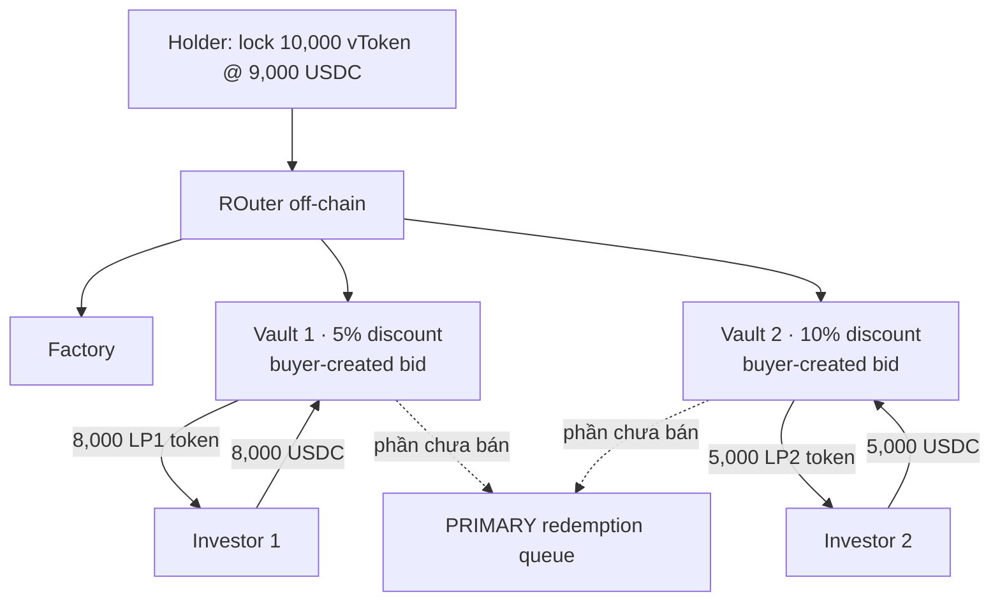
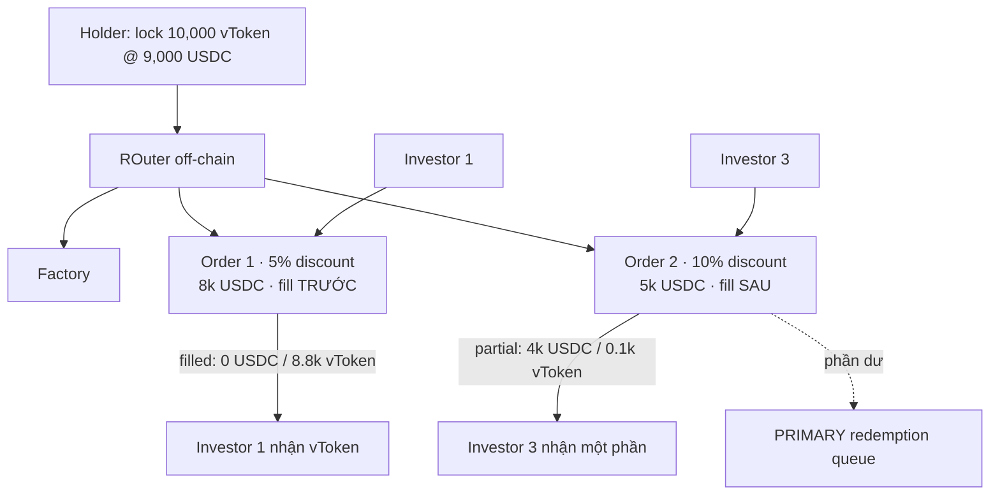

# OTC / Early-Exit Secondary Market — 3 variants

> **Trạng thái:** brainstorm khám phá, **chưa vào scope POC**. Đây là tài liệu giải mã 3 variant trong sketch
> (`variant 1a / 2 / 3`), mô tả bài toán chúng giải và cách hoạt động chi tiết.
> POC retail hiện tại **không có** lớp này — đường thoát duy nhất là `requestRedeem` → `processEpoch` → `claim`.

---

## 1. Bài toán đang giải

Cả 3 variant cùng giải **một** bài toán: **làm sao để người giữ vToken thoát vốn *ngay*, trước khi tài sản nền đến kỳ
redemption tự nhiên** — bằng cách bán lại cho nhà đầu tư khác ở **mức chiết khấu**, thay vì xếp hàng chờ.

Có hai góc nhìn. Góc **standalone** là góc chính — nó định nghĩa sản phẩm, nên trình bày kỹ. Góc **ghép vào retail**
chỉ nêu **ngắn gọn**, liên hệ nhẹ sang project hiện tại (không phải vì nó đơn giản hơn, mà vì ở đây ta chỉ cần điểm
qua chỗ móc nối).

### 1.1 Góc standalone (quan trọng hơn) — "chợ thứ cấp cho tài sản redemption-chậm"

Bối cảnh tổng quát, **không phụ thuộc** vault retail của ta:

- Có một loại token đại diện quyền với tài sản **redemption chậm** — gọi chung là `vToken` (vault token / fund share).
  Muốn đổi `vToken → tiền mặt` theo kênh chính thức (redeem qua quỹ) thì **chậm**: phải chờ cửa sổ / hàng đợi, và
  trả theo NAV.
- **Người bán (holder)** cần tiền *bây giờ*, chấp nhận **bán dưới NAV** (chiết khấu) để có thanh khoản tức thì.
- **Người mua (investor)** sẵn sàng bỏ USDC ngay để **mua rẻ hơn NAV**, rồi *họ* mới là người chịu chờ redemption →
  ăn phần chiết khấu như lợi suất.

Bài toán thiết kế: dựng một **secondary market / OTC layer** đáp ứng các yêu cầu:

| Yêu cầu | Vì sao |
|---|---|
| Niêm yết bán vToken ở một mức chiết khấu | người bán phát tín hiệu giá thoát |
| Nhận USDC từ người mua *ngay* | thanh khoản tức thì cho người bán |
| **Khám phá giá** (mức chiết khấu nào khớp) | thị trường tự định giá phần bù thanh khoản |
| **Khớp một phần (partial fill)** | hiếm khi có đủ người mua cho toàn bộ lô |
| **Fallback** phần không bán được | đẩy về **PRIMARY redemption queue** (kênh chậm) — không ai bị kẹt |
| Điều phối off-chain, settle on-chain | matching linh hoạt; tiền/đối tượng giữ on-chain |

Các thực thể lặp lại trong cả 3 sketch:

```
Holder (seller) ── lock vToken @ discount ──► [ listing layer ] ──► Investors (buyers) pay USDC now
                                                     │
                                            phần không khớp
                                                     ▼
                                         PRIMARY redemption queue  (kênh chậm, NAV)
```

- **ROuter (off-chain):** bộ điều phối — đọc tổng thanh khoản (`Check total balance`), chia lô vToken, ghép người mua.
- **Factory:** deploy các listing (vault/order) khi cần.
- **PRIMARY redemption queue:** kênh redeem gốc, nơi mọi phần ế rơi về.

> **Phần bù thanh khoản (chiết khấu) là tiền người bán *trả*, người mua *ăn*** — mặc định giao thức không lấy gì
> (trừ khi cắm thêm một khoản phí lên trên, xem `docs/06-fees`).

### 1.2 Góc ghép vào project retail (liên hệ ngắn)

Đặt vào vault retail hiện tại: `vToken` chính là **rACCESS shares**, và lớp OTC trở thành một **"Layer 0" — đường thoát
nhanh đặt *trước* hàng đợi redemption** ta đã có:

```
Muốn rút:
   ┌─ Layer 0  OTC / early-exit   ◀ MỚI: bán share cho retail khác ở discount, nhận USDC ngay
   │     (phần không bán được rơi xuống ▼)
   ├─ Layer 1  P2P matching       (đã có: net sub vs redeem trong processEpoch)
   ├─ Layer 2  liquid buffer       (đã có)
   └─ Layer 3  illiquid Pruv       (đã có)
```

Điểm móc nối sẵn có: NAV đã được admin set mỗi epoch (`INavSource`) nên "discount so với NAV" tính được ngay; redemption
queue đã tồn tại làm fallback; `vToken` đã là ERC-20 share chuẩn.

Phần *không* trivial khi ghép (để mở, xem §7): Layer 0 đứng trước matching nên phải định nghĩa rõ quan hệ với
`cancelRequest`, và share đang khóa trong OTC có còn được tính NAV / redeem song song hay không.

#### Toàn cảnh: early-exit nằm ở đâu trong mỗi alternative

PRD retail có **2 alternative** về cách giữ tài sản subscription. Vị trí của lớp early-exit **khác hẳn nhau** giữa hai:

| | **Alt-1 — self-built custody** (đang build) | **Alt-2 — Balancer-backed** (không chọn) |
|---|---|---|
| Tài sản giữ ở đâu | custody tự build (wRWA + liquid buffer) | khóa trong **Balancer pool**, vault giữ ETF/LP token |
| `totalAssets()` đọc | giá Pruv × wRWA + liquid | giá trị ETF token theo pool |
| Thoát vốn "chính thức" | redemption queue 3 lớp (chậm, theo NAV) | redeem ETF khỏi pool → queue (chậm) |
| **Thoát nhanh (early-exit)** | **CHƯA CÓ — phải tự build** | **ĐÃ CÓ MỘT PHẦN — chính là Balancer pool** |

- **Alt-1 → lớp early-exit là mảnh còn thiếu, phải tự dựng.** Custody không có thanh khoản thứ cấp; đường ra duy nhất
  là queue chậm. Đây **chính xác là chỗ 3 variant (1a / 2 / 3) lấp vào** — một **Layer 0 OTC** trên `rACCESS share`,
  discount đặt thủ công, phần ế rơi xuống redemption queue.
- **Alt-2 → Balancer pool *đã là* một early-exit.** Vì tài sản nằm trong AMM, ai muốn thoát có thể **swap ETF token →
  stablecoin ngay** ở giá pool — **slippage/spread chính là "discount" do thị trường định**. Cơ chế thoát nhanh phần
  lớn **có sẵn ở tầng tài sản**, nên một OTC orderbook riêng trở nên *tùy chọn / phần nào dư thừa*; nó chỉ còn ý nghĩa
  nếu muốn một chợ riêng ở **tầng vault-share** (khi share không tự trade được trên AMM).

Sơ đồ đặt cạnh nhau:

```
ALT-1 (self-built custody)                       ALT-2 (Balancer-backed)
──────────────────────────                       ───────────────────────
holder muốn thoát                                 holder muốn thoát
   │                                                 │
   ├─ NHANH: [ OTC Layer 0 ]  ◀ PHẢI BUILD           ├─ NHANH: swap qua Balancer pool  ◀ CÓ SẴN
   │     variant 1a / 2 / 3, discount thủ công        │     giá AMM, discount = slippage
   │     phần ế ▼                                      │     (OTC trên share: chỉ là tuỳ chọn)
   └─ CHẬM: redemption queue (NAV)                    └─ CHẬM: redeem ETF khỏi pool → queue (NAV)
```

#### Timeline — nhanh vs chậm trong nhịp epoch

Early-exit chỉ có nghĩa **giữa hai epoch tick**: thay vì chờ tick kế để settle theo NAV, holder thoát ngay và chịu chiết khấu.

```
 epoch N tick ───────────────── (khoảng chờ) ───────────────── epoch N+1 tick
       ▲                                                              ▲
  holder muốn thoát ở đây                                       settlement kế tiếp
       │
       ├─ CHẬM  (queue)  : requestRedeem ───── chờ tới N+1 ─────► claim @ NAV          đúng NAV, mất 1 epoch
       └─ NHANH (early)  :
              Alt-1 → bán trên OTC Layer 0  ──► USDC ngay @ NAV − discount             nhanh, chịu chiết khấu
              Alt-2 → swap Balancer pool     ──► USDC ngay @ giá pool (≈ NAV − slippage)
```

**Chốt một câu:** ba variant trong tài liệu này là câu trả lời cho bài toán **early-exit của Alt-1**. Trong Alt-2,
phần lớn bài toán đã được Balancer giải sẵn (AMM = thanh khoản tức thì + giá thị trường), nên nếu sau này migrate sang
Alt-2 thì phải cân nhắc lại: dùng thẳng pool hay vẫn cần OTC ở tầng share.

---

## 2. Setup chung của cả 3 variant

Mọi sketch bắt đầu **giống hệt nhau**, chỉ khác ở cách hiện thực hóa "listing layer":

```
Holder mua 10,000 vToken @ 1 USDC        → bỏ vào 10,000 USDC
Holder muốn bán 10,000 vToken, discount 10%  → 1 vToken = 0.9 USDC  → niêm yết 9,000 USDC
        │
   Lock 10,000 vToken @ 9,000 USDC
        │
   ROuter (off-chain)  ── Check total balance: total 13,000 USDC khả dụng từ người mua
        │
   ... chia lô + tạo listing (KHÁC NHAU giữa 3 variant) ...
        │
   phần ế ──► PRIMARY redemption queue
```

**Dải tiến hóa:** ba variant là ba mức **gom/đơn giản hóa** của cùng ý tưởng:

```
1a  vault MỖI người mua        →  2  vault MỖI mức discount        →  3  KHÔNG vault, orderbook FIFO
    (linh hoạt nhất, đắt nhất)     (gom theo tier, LP fungible)        (gọn & rẻ nhất)
```

---

## 3. Variant 1a — vault mỗi người mua (bid-driven, ERC-4626)

*Sketch: "uses ERC 4626 for the vault, gives out vault token". Anh em với **1b** ("normal smart contract to lock, no vault token") — cùng ý tưởng nhưng 1b không phát LP token.*

**Ý tưởng:** mỗi **người mua tự tạo một vault riêng** ở mức discount *họ* chọn (một cú **bid**). Mỗi vault là một
ERC-4626 độc lập, phát **LP token riêng** cho đúng người mua đó.



**Diễn biến (đọc theo các khung trái→phải trong sketch):**

1. Holder lock 10k vToken. Hai người mua mở hai vault ở hai mức bid khác nhau:
   - **Vault 1 — 5% discount:** Investor 1 nạp 8,000 USDC → nhận **8,000 LP1 token**.
   - **Vault 2 — 10% discount:** Investor 2 nạp 5,000 USDC → nhận **5,000 LP2 token**.
2. Phần vToken **chưa có người mua** trong mỗi vault → *queued for redemption* (vd "5k vToken queued for redemption
   for vault 1 / vault 2").
3. Khi redemption về, vToken trong vault được *"redeemed for ~5.1% USDC"* (ghi chú `short exchange.net` trong sketch),
   investor giữ LP token tương ứng với quyền của mình.

**Đặc trưng:** discount **do người mua quyết** (mỗi bid = một vault). LP token mỗi vault **không thay thế nhau**.

| Ưu | Nhược |
|---|---|
| Khám phá giá tốt nhất (reverse auction thật) | **Đắt:** mỗi bid = deploy 1 ERC-4626 + 1 LP token |
| LP token có thể trở thành sản phẩm giao dịch tiếp | **Phân mảnh:** N người mua = N vault, N loại LP rời rạc |
| Người bán được lấp ở mức tốt nhất trước | Khó gộp thanh khoản, vận hành nặng |

---

## 4. Variant 2 — vault mỗi mức discount (pooled tier, LP fungible)

*Sketch: "Per discount vault".*

**Ý tưởng:** **một vault cho mỗi *mức* discount** (5%, 10%, …), **nhiều người mua dồn chung** vào vault cùng tier và
nhận **LP token fungible trong tier đó**. Đây là bước gom của 1a: thay vì vault-mỗi-người, giờ là vault-mỗi-mức-giá.

```mermaid
graph TD
    H[Holder: lock 10,000 vToken @ 9,000 USDC] --> R[ROuter off-chain]
    R --> F[Factory]
    R -->|"10k x 11/16 = 6.875k vToken"| V1[Vault 1 · 5% discount<br/>demand 11k USDC]
    R -->|"10k x 5/16 = 3.125k vToken"| V2[Vault 2 · 10% discount<br/>demand 5k USDC]
    I1[Investor 1] -->|8,000 USDC| V1
    I2[Investor 2] -->|3,000 USDC| V1
    I3[Investor 3] -->|5,000 USDC| V2
    V1 -->|LP1 token pro-rata| I1
    V1 -->|LP1 token pro-rata| I2
    V2 -->|LP2 token| I3
    V1 -. 6.875k vToken .-> Q[PRIMARY redemption queue]
    V2 -. 3.125k vToken .-> Q
```

**Diễn biến:**

1. **Chia lô theo cầu:** Vault 1 (5%) gom được cầu **11k USDC** (Investor 1: 8k + Investor 2: 3k), Vault 2 (10%) gom
   **5k USDC** (Investor 3). Tổng cầu 16k → ROuter chia 10k vToken theo tỉ lệ:
   - Vault 1: `10k × 11/16 = 6.875k vToken`
   - Vault 2: `10k × 5/16 = 3.125k vToken`
2. Nhiều investor **dồn chung một vault tier**, nhận **LP1 token theo pro-rata** (Investor 1 và 2 đều giữ LP1 — *cùng
   loại, fungible*). Đây là khác biệt cốt lõi so với 1a (ở 1a mỗi người một loại LP).
3. Phần vToken trong mỗi vault → **queued for redemption** (6.875k cho vault 1; 3.125k cho vault 2); vault giữ USDC còn
   lại (Vault1: ~4.125k; Vault2: ~1.875k) để settle khi redemption về.

**Đặc trưng:** mức discount là **tier dùng chung** (bán-có-sẵn-cấu-trúc), người mua chọn tier để vào; LP token
fungible trong tier.

| Ưu | Nhược |
|---|---|
| LP token **fungible theo tier** → gộp thanh khoản tốt | Discount rời rạc theo tier, không mịn như bid tự do |
| Ít vault hơn 1a (theo số mức giá, không theo số người) | Vẫn cần Factory + nhiều vault + nhiều loại LP |
| Pro-rata trong tier dễ hiểu, công bằng | Logic chia lô theo cầu (tỉ lệ 11/16, 5/16) phức tạp hơn |

---

## 5. Variant 3 — orderbook FIFO (không vault, không LP token)

*Sketch: "FIFO order".*

**Ý tưởng:** bỏ hẳn vault và LP token. Mỗi mức bán là một **Order** nhẹ trong một sổ lệnh chung, khớp theo
**vào-trước-ra-trước (FIFO)**. Đây là bước gom triệt để nhất.



**Diễn biến (2 khung: đặt lệnh → sau khớp FIFO):**

1. **Đặt lệnh:** ROuter tách thành hai order:
   - **Order 1 — 5% discount, 8k USDC** (Investor 1) — `10k vToken × 8/9 ≈ 8.8k`
   - **Order 2 — 10% discount, 5k USDC** (Investor 3) — `10k vToken × 1/9 ≈ 0.1k`
2. **Khớp FIFO:** order vào trước được lấp đầy trước:
   - **Order 1** khớp hết → còn **0 USDC, 8.8k vToken** chuyển cho Investor 1.
   - **Order 2** khớp sau, chỉ một phần → còn **4k USDC, 0.1k vToken**.
3. Phần dư của Order 2 → **PRIMARY redemption queue** (mũi tên xuống dưới cùng trong sketch).

**Đặc trưng:** không vault, không LP token; chỉ order + sổ; khớp thuần FIFO; phần ế rơi về queue.

| Ưu | Nhược |
|---|---|
| **Rẻ & gọn nhất** — không deploy vault, không token mới | FIFO không tối ưu giá (lệnh sớm khớp trước, kể cả giá xấu hơn) |
| Dễ hiểu, dễ audit, ít bề mặt tấn công | Người mua không cầm "sản phẩm" giao dịch tiếp (không LP token) |
| Hợp nhất với vault retail nhất (chỉ cần share + queue) | Khám phá giá kém linh hoạt hơn auction |

---

## 6. So sánh 3 variant

| Tiêu chí | **1a** per-buyer vault | **2** per-discount vault | **3** FIFO orderbook |
|---|---|---|---|
| Đơn vị niêm yết | 1 vault / người mua | 1 vault / mức discount | 1 order / lệnh |
| Ai quyết discount | người mua (bid tự do) | chọn theo tier có cấu trúc | theo order, khớp FIFO |
| Người mua nhận | LP token **riêng** mỗi vault | LP token **fungible** trong tier | vToken trực tiếp (không token) |
| Cách khớp | per-vault | pooled theo tier | **FIFO** |
| Phần ế | → redemption queue | → redemption queue | → redemption queue |
| Hạ tầng cần | Factory + N vault + N LP | Factory + vault-per-tier + LP-per-tier | chỉ orderbook |
| Chi phí / phức tạp | **Cao nhất** | Trung bình | **Thấp nhất** |
| Khám phá giá | Tốt nhất (auction) | Theo tier | FIFO (kém mịn) |
| Hợp với retail POC | nặng | trung bình | **phù hợp nhất** |

**Tóm tắt:** ba variant là **một bài toán — ba microstructure**, gom dần từ trái sang phải. Chọn theo mục tiêu:

- Cần **sản phẩm thị trường thứ cấp đầy đủ** (LP token giao dịch tiếp, đấu giá thật): **1a**, chấp nhận đắt.
- Cần **thanh khoản gộp theo tier, vẫn có token đại diện**: **2**.
- Cần **một đường thoát sớm nhẹ, rẻ, ghép thẳng vào vault retail**: **3** — và đây là lựa chọn hợp lý nhất nếu lớp
  này được đưa vào project hiện tại như **Layer 0** trước redemption queue.

---

## 7. Câu hỏi mở (trước khi đưa vào scope)

1. Lớp OTC này là **standalone product** hay chỉ là **early-exit path** của vault retail? Quyết định này chọn luôn variant.
2. Share đang khóa trong OTC có còn được tính vào NAV / được redeem song song không? (tránh double-count)
3. Có cắm **phí** lên discount không, hay để 100% phần bù cho người mua? (nối với `docs/06-fees` — early-exit / instant-exit)
4. Matching off-chain (ROuter) cần mức tin cậy nào — ai chạy, settle on-chain ra sao để không cần tin ROuter?
5. Quan hệ với `cancelRequest` và state machine: OTC mở ở state nào (chỉ `EpochBased`?), đóng khi `WindDown`?
